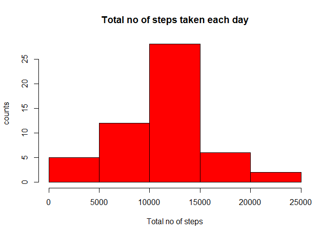
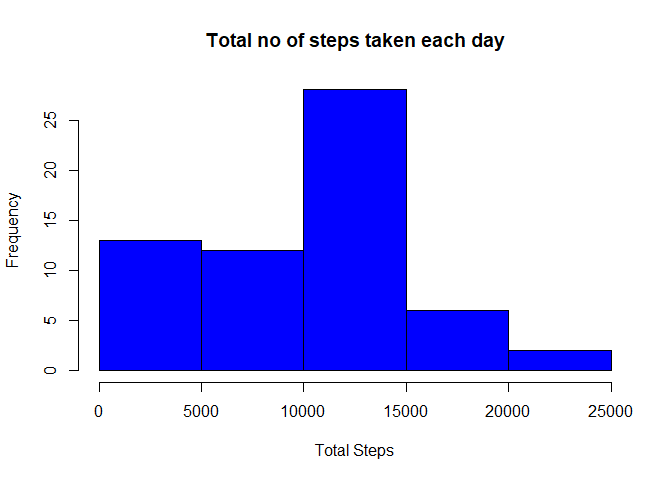

##Assignment Instructions
.Code for reading in the dataset and/or processing the data

.Histogram of the total number of steps taken each day

.Mean and median number of steps taken each day

.Time series plot of the average number of steps taken

.The 5-minute interval that, on average, contains the maximum number of steps

.Code to describe and show a strategy for imputing missing data

.Histogram of the total number of steps taken each day after missing values are imputed

.Panel plot comparing the average number of steps taken per 5-minute interval across weekdays and
weekends

.All of the R code needed to reproduce the results (numbers, plots, etc.) in the report

##Step 1
##Code for reading in the dataset and/or processing the data

```r
setwd( "C:/Users/hp/Desktop/reproducible research project 1")
csvfile<-read.csv("activity.csv")
```

Exploring the basics of this data


```r
dim(csvfile)
```

```
## [1] 17568     3
```

```r
names(csvfile)
```

```
## [1] "steps"    "date"     "interval"
```

```r
head(csvfile)
```

```
##   steps       date interval
## 1    NA 2012-10-01        0
## 2    NA 2012-10-01        5
## 3    NA 2012-10-01       10
## 4    NA 2012-10-01       15
## 5    NA 2012-10-01       20
## 6    NA 2012-10-01       25
```

```r
str(csvfile)
```

```
## 'data.frame':	17568 obs. of  3 variables:
##  $ steps   : int  NA NA NA NA NA NA NA NA NA NA ...
##  $ date    : Factor w/ 61 levels "2012-10-01","2012-10-02",..: 1 1 1 1 1 1 1 1 1 1 ...
##  $ interval: int  0 5 10 15 20 25 30 35 40 45 ...
```

```r
#total number of missing data
sum(is.na(csvfile$steps))/dim(csvfile)[[1]]
```

```
## [1] 0.1311475
```

```r
#transforming the date column into date format using lubridate
library(lubridate)
```

```
## 
## Attaching package: 'lubridate'
```

```
## The following objects are masked from 'package:base':
## 
##     date, intersect, setdiff, union
```

```r
csvfile$date<-ymd(csvfile$date)
length(unique(csvfile$date))
```

```
## [1] 61
```

##Step 2

##Histogram of the total number of steps taken each day


```r
#To plot the histogram of total number of steps taken per day

# Read the data form the "csv" file "activity.csv" in your wd if you havent already

csvfile<-read.csv("activity.csv")

#unload dplyr package
library(dplyr)
```

```
## 
## Attaching package: 'dplyr'
```

```
## The following objects are masked from 'package:lubridate':
## 
##     intersect, setdiff, union
```

```
## The following objects are masked from 'package:stats':
## 
##     filter, lag
```

```
## The following objects are masked from 'package:base':
## 
##     intersect, setdiff, setequal, union
```

```r
df<- tbl_df(csvfile)
#Find the sum of steps taken each day
moddf<-df%>%group_by(date)%>%summarise(steps=sum(steps))
#plot using base plot technique
hist(moddf$steps,col = "red",xlab = "Total no of steps",ylab = "counts",main = "Total no of steps taken each day")
```

<!-- -->

##Step 3

##Mean and median number of steps taken each day


```r
# Read the data form the "csv" file "activity.csv" in your wd if you havent already

csvfile<-read.csv("activity.csv")

#unload dplyr package
library(dplyr)
df<- tbl_df(csvfile)
#To find the mean and median for each day and prepare a seperate table
moddf<-df%>%group_by(date)%>%summarise(median(steps),mean(steps))
summary(moddf)
```

```
##          date    median(steps)  mean(steps)     
##  2012-10-01: 1   Min.   :0     Min.   : 0.1424  
##  2012-10-02: 1   1st Qu.:0     1st Qu.:30.6979  
##  2012-10-03: 1   Median :0     Median :37.3785  
##  2012-10-04: 1   Mean   :0     Mean   :37.3826  
##  2012-10-05: 1   3rd Qu.:0     3rd Qu.:46.1597  
##  2012-10-06: 1   Max.   :0     Max.   :73.5903  
##  (Other)   :55   NA's   :8     NA's   :8
```

```r
mean(df$steps,na.rm=TRUE)
```

```
## [1] 37.3826
```

```r
median(df$steps,na.rm=TRUE)
```

```
## [1] 0
```
hence the mean is 37.3826 and median is 0

##Step 4

##Time series plot of the average number of steps taken


```r
averageday <- df %>%
  group_by(interval) %>%
  summarize("average" = mean(steps, na.rm = TRUE))

plot(averageday$interval, averageday$average, type = "l", main = "Timeseries of average steps",
     col = "cyan4", ylab = "Average Steps", xlab = "Interval")
```

<!-- -->


##Step 5

##The 5-minute interval that, on average, contains the maximum number of steps


```r
#This is assuming that the words on average means averaging steps by date and interval

csvfile<-read.csv("activity.csv")

#unload dplyr package
library(dplyr)
df<- tbl_df(csvfile)
#to calculate max
df$interval<-factor(df$interval)
moddf4<-aggregate(data=df,steps~date+interval,FUN="mean")
max<-aggregate(data=moddf4,steps~interval,FUN="max")
max(max$steps)
```

```
## [1] 806
```
The average daily pattern shows very low steps between 0 and the 500th interval then a rise to around 50 steps per interval with a maximum of 206 steps at the 835th interval. After this peak, steps hover between 50 and 100 sets per interval until they decline around 1900.


##Step 6

Code to describe and show a strategy for imputing missing data
There are multiple strategies to deal with multiple value imputations.
The common strategies include:
1. Constant value imputations
2. Regression model value imputations
3. Mean/mode value substitutions
For the purpose of simplicity, in this question, I will use the mean/mode value substitution strategy to impute missing values. That is, using the mean values to substitute out the missing values in the original data set
Before doing any sort of imputation, it is helpful to understand what are the distributions of missing values by date and interval


```r
#To find NA values in "steps" and impute mean values in place of NA values 

# Read the data form the "csv" file "activity.csv" in your wd if you havent already

csvfile<-read.csv("activity.csv")

#unload dplyr package
library(dplyr)
df<- tbl_df(csvfile)

#Find the total no of NA values in the data "steps"
sum(is.na(df$steps))
```

```
## [1] 2304
```

```r
#create a set of values to be imputed in place of these NAs
moddf2<-df%>%group_by(date)%>%mutate(mean=mean(steps))
imputed<-moddf2$mean[is.na(moddf2$mean)!= TRUE]
#"imputed" contains a set of values to be filled in place of NAs
#create "replace_df" containing replaced values of "steps"
replace_df<-df%>%group_by(date)%>%mutate(replaced_steps=ifelse(is.na(steps),yes = imputed,no=steps))
#replace_steps column is the imputed version of steps column in replace_df
head(replace_df)
```

```
## # A tibble: 6 x 4
## # Groups:   date [1]
##   steps date       interval replaced_steps
##   <int> <fct>         <int>          <dbl>
## 1    NA 2012-10-01        0          0.438
## 2    NA 2012-10-01        5          0.438
## 3    NA 2012-10-01       10          0.438
## 4    NA 2012-10-01       15          0.438
## 5    NA 2012-10-01       20          0.438
## 6    NA 2012-10-01       25          0.438
```

```r
sum(is.na(replace_df$replaced_steps))
```

```
## [1] 0
```

```r
mean(replace_df$replaced_steps)
```

```
## [1] 32.53734
```

```r
median(replace_df$replaced_steps)
```

```
## [1] 0
```

## Step 7
Histogram of the total number of steps taken each day after missing values are imputed


```r
#Make a histogram of the total number of steps taken each day 
replace_sum<-tapply(replace_df$replaced_steps,replace_df$date,sum)


hist(replace_sum,col = "blue",xlab = "Total Steps",main = "Total no of steps taken each day")
```

<!-- -->

## Step 8
Panel plot comparing the average number of steps taken per 5-minute interval across weekdays and weekends


```r
#first we make a seperate column representing if the given day is weekend or weekday
df$date <- as.Date(strptime(df$date, format="%Y-%m-%d"))
df$datetype <- sapply(df$date, function(x) {
  if (weekdays(x) == "Saturday" | weekdays(x) =="Sunday") 
    {y <- "Weekend"} 
  else 
    {y <- "Weekday"}
  y
})
#now we plot panel graphs giving info about steps taken per interval based on weekday/weekend info
library(ggplot2)
activity_by_date <- aggregate(steps~interval + datetype, df, mean, na.rm = TRUE)
g<-qplot(x=interval,y=steps,data = activity_by_date,facets = .~datetype,geom = "line",group=1)
print(g)
```

<!-- -->


